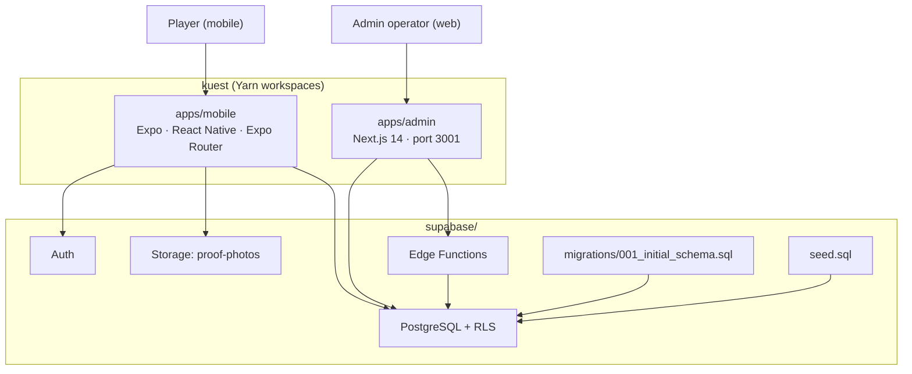
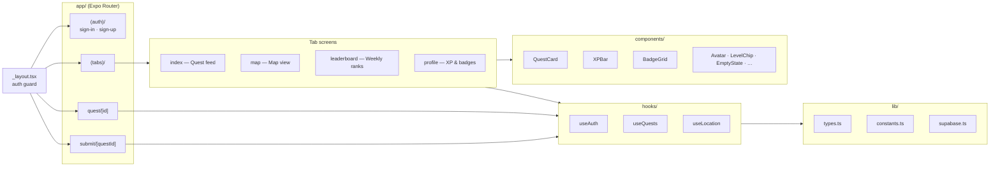
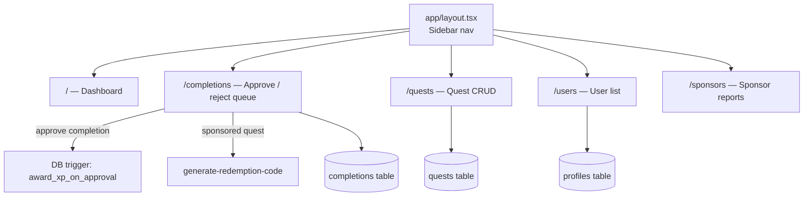
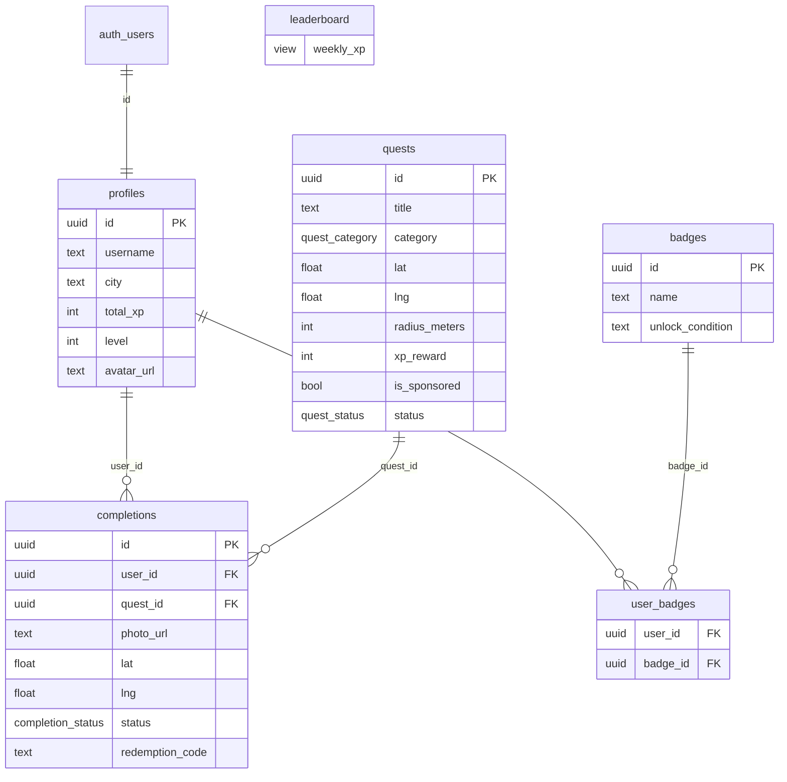
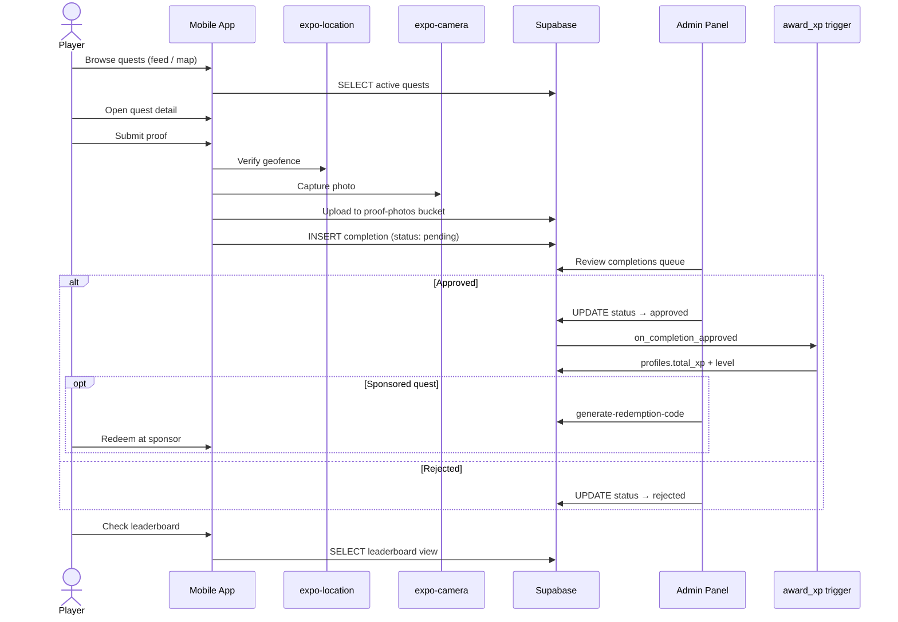

# Kuest Architecture

Visual map of the codebase — a monorepo for a gamified city quest app with two clients and a Supabase backend.

## High-level architecture



## Mobile app structure



## Admin dashboard



## Database schema



## Core quest flow



## Folder tree

```
Kuest/
├── apps/
│   ├── mobile/          Expo app (player-facing)
│   │   ├── app/         Routes: auth, tabs, quest detail, submit
│   │   ├── components/  UI: QuestCard, XPBar, BadgeGrid, …
│   │   ├── hooks/       useAuth, useQuests, useLocation
│   │   └── lib/         types, constants, supabase client
│   └── admin/           Next.js dashboard (operator-facing)
│       └── app/         pages: completions, quests, users, sponsors
└── supabase/
    ├── migrations/      Schema, RLS, triggers, storage
    ├── functions/       award-xp, generate-redemption-code
    └── seed.sql         Starter quests & badges
```
